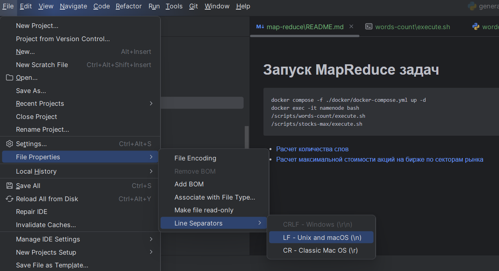

# Запуск MapReduce задач

Перед началом работы у скриптов maper.py & reducer.py нужно установить Unix-line separator


Далее, в терминале:
```
docker compose -f ./docker/docker-compose.yml up -d
docker exec -it namenode bash
/scripts/words-count/execute.sh
/scripts/stocks-max/execute.sh
```

- [Расчет количества слов](words-count)
- [Расчет максимальной стоимости акций на бирже по секторам рынка](stocks-max)